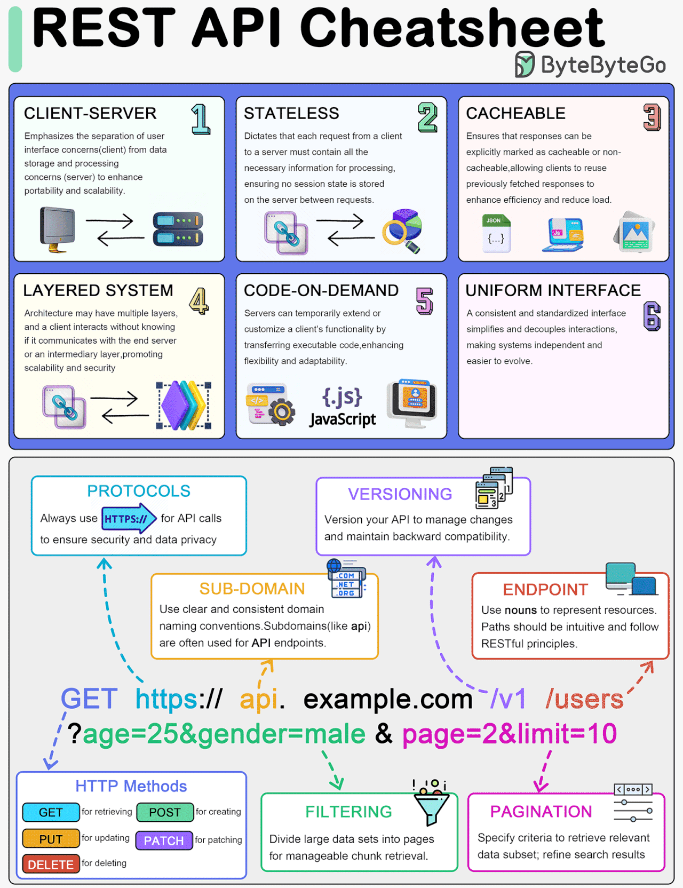
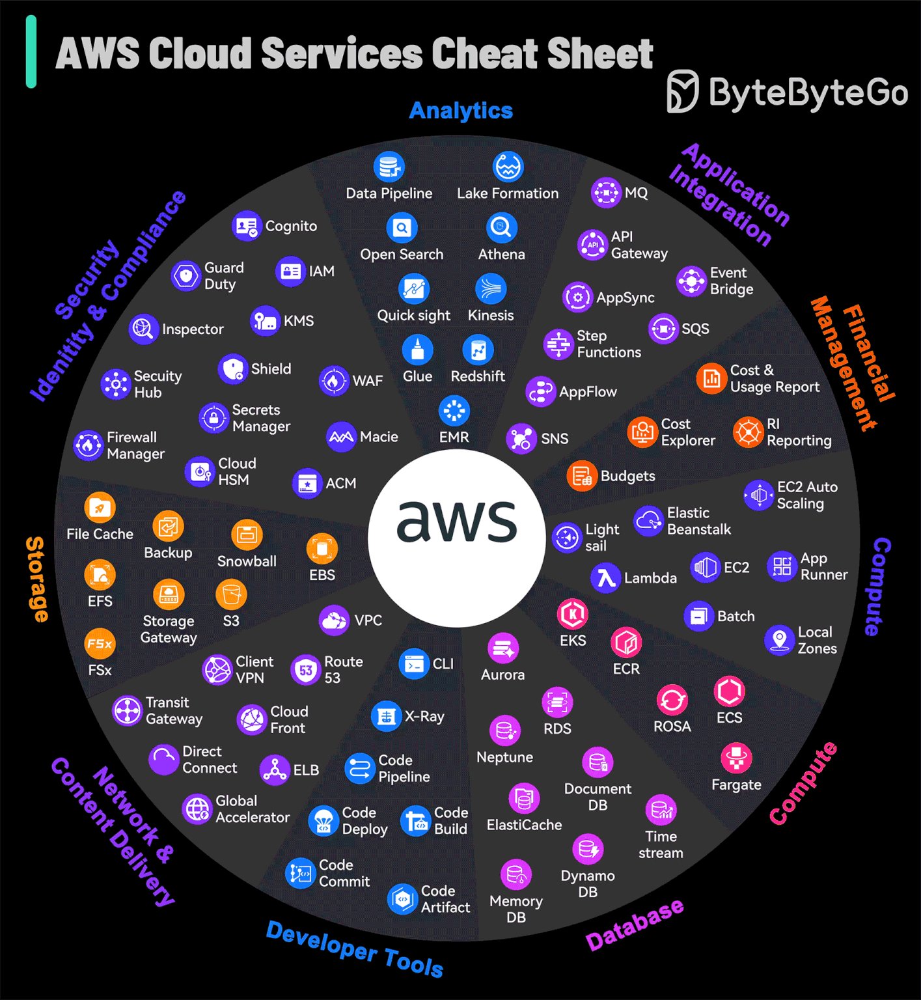
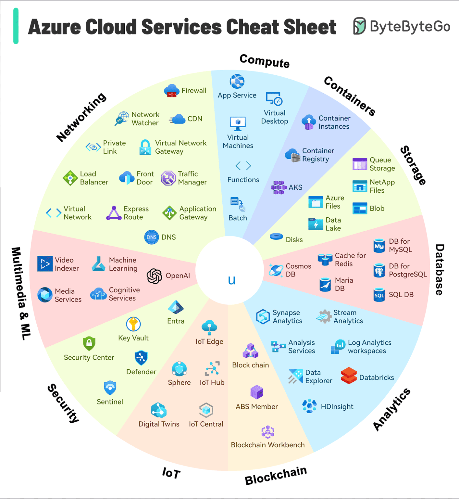

> 📚 Awesome cheatsheets for popular programming languages, frameworks and development tools. They include everything you should know in one single file.

REST API

## 📚 Table of Contents

### 📃 Languages

View cheatsheets

#### Command line interface

- [Bash](languages/bash.sh)

#### Imperative

- [C](languages/C.txt)
- [C#](languages/C%23.txt)
- [Go](languages/golang.md)
- [Java](languages/java.md)
- [PHP](languages/php.php)
- [Python](languages/python.md)

#### Functional

- [JavaScript](languages/javascript.js)

### 📦 Backend

View cheatsheets

#### PHP

- [Laravel](backend/laravel.php)

#### Python

- [Django](backend/django.py)

#### Javascript

- [Adonis.js](backend/adonis.js)
- [Express.js](backend/express.js)
- [Feathers.js](backend/feathers.js)
- [Moleculer](backend/moleculer.js)
- [Node.js](backend/node.js)
- [Sails.js](backend/sails.js)
  

### 🌐 Frontend

View cheatsheets

#### Basics

- [HTML5](frontend/html5.html)
- [CSS3](frontend/css3.css)

#### Frameworks

- [React.js](frontend/react.js)
- [Vue.js](frontend/vue.js)
- [Tailwind.css](frontend/tailwind.css)
- [Ember.js](frontend/ember.js)
- [Angular (2+)](frontend/angular.js)
- [AngularJS](frontend/angularjs.js)
  

### 🗃️ Databases

View cheatsheets

#### SQL

- [MySQL](databases/mysql.sh)

#### NoSQL

- [Redis](databases/redis.sh)
  

###  Odoo

  
View cheatsheets

  - [Odoo](odoo/odoo.md)

### 🔧 Tools

View cheatsheets

#### Development
- [cURL](tools/curl.sh)
- [Drush](tools/drush.sh)
- [Elasticsearch](tools/elasticsearch.js)
- [Emmet](tools/emmet.md)
- [Git](tools/git.sh)
- [Puppeteer](tools/puppeteer.js)
- [Sublime Text](tools/sublime_text.md)
- [VIM](tools/vim.txt)
- [Visual Studio Code](tools/vscode.md)
- [Xcode](tools/xcode.txt)

#### Infrastructure
- [AWS CLI](tools/aws.sh)

- [Docker](tools/docker.sh)
- [Heroku CLI](tools/heroku.sh)
- [Kubernetes](tools/kubernetes.md)
- [Nanobox Boxfile](tools/nanobox_boxfile.yml)
- [Nanobox CLI](tools/nanobox_cli.sh)
- [Nginx](tools/nginx.sh)
- [PM2](tools/pm2.sh)
- [Ubuntu](tools/ubuntu.sh)
- [Firebase CLI](tools/firebase_cli.md)
- [Terraform CLI](tools/terraform_cli.md)
- [Content Delivery Network (CDN)](CDN/cdn.md)
  

### 🎓 Roadmap

Developer Roadmaps
[roadmap.sh](https://roadmap.sh/). is a community effort to create roadmaps, guides and other educational content to help guide developers in picking up a path and guide their learnings.

A Roadmap for Full-Stack Development

- [Full-Stack Development roadmap](roadmap/fullstack/fullstack.md)

