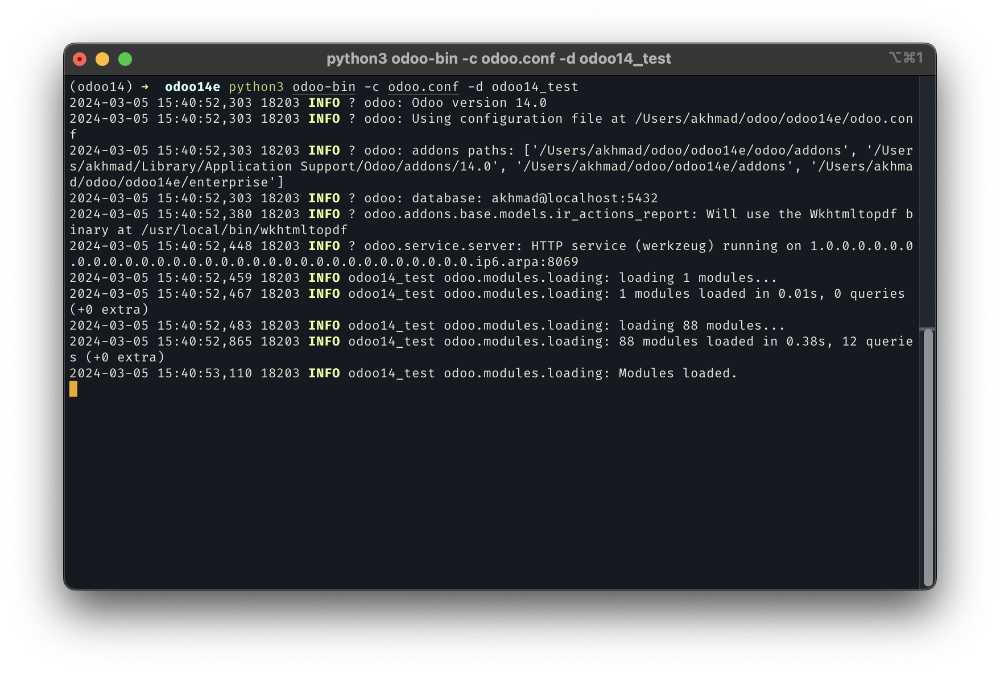
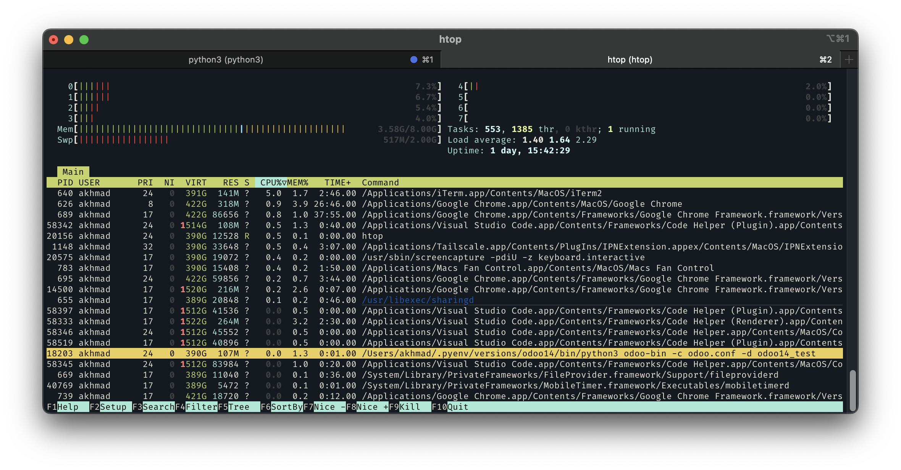
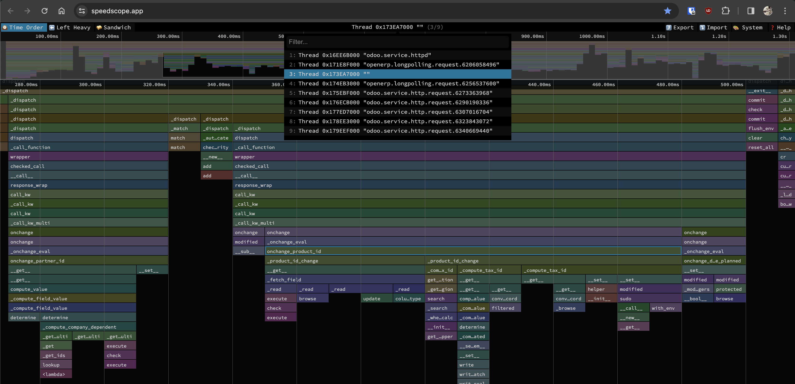

# Odoo Profiling With py-spy

Odoo already have a tool to [profiling the code](https://www.odoo.com/documentation/14.0/developer/howtos/profilecode.html#profiling-odoo-code) inside the module. But sometimes we don't know where the performance issue came from so we can't just add decorator `@profile` to every methods we have. In this case, there is a tool called [py-spy](https://github.com/benfred/py-spy) that can attach to Odoo main process directly.

## Installation
For most cases, we can easily install it using `pip`
```sh
python3 -m pip install py-spy
```
please follow [this installation section](https://github.com/benfred/py-spy?tab=readme-ov-file#installation) from py-spy

## Usage
We will restrict py-spy in here to record by attaching to Odoo main process ID and check the flamegraph using [Speedscope.app](https://www.speedscope.app/). As for details in usage, you can always [check it here](https://github.com/benfred/py-spy?tab=readme-ov-file#usage)

1. After you have installed py-spy, you can always confirm if it installed by using `--help` flag
    ```sh
    $ py-spy --help
    py-spy 0.3.14
    Sampling profiler for Python programs

    USAGE:
        py-spy <SUBCOMMAND>

    OPTIONS:
        -h, --help       Print help information
        -V, --version    Print version information

    SUBCOMMANDS:
        record    Records stack trace information to a flamegraph, speedscope or raw file
        top       Displays a top like view of functions consuming CPU
        dump      Dumps stack traces for a target program to stdout
        help      Print this message or the help of the given subcommand(s)
    $ 
    ```
2. Run odoo, in this case, we will run odoo-bin manually inside virtual environment
    
3. Open new terminal in new tab (or window), then find the process ID. We can use `top`, or `htop` to find the process and write-down the process ID to run odoo (here we use `htop` and use Search function to find `odoo-bin`, and found the process ID is `18203`)
    
4. Then close `htop`, and run py-spy record while attach to process ID above (you can always check available flags with `py-spy record --help`)
    ```sh
    py-spy record -p 18203 -f speedscope -o odoo-profiling.txt
    ```
5. It will show like this when it is recording. While at it, try some function in odoo (like create Purchase Order, Sales Order, or anything you want to check the traces)
    ```sh
    (odoo14) ➜  odoo14e sudo py-spy record -p 18203 -f speedscope -o odoo-profiling.txt
    py-spy> Sampling process 100 times a second. Press Control-C to exit.
    ```
6. After it's done, just cancel py-spy process with `CTRL+C`, and new file will be created at the same directory you run `py-spy`
    ```sh
    (odoo14) ➜  odoo14e sudo py-spy record -p 18203 -f speedscope -o odoo-profiling.txt
    py-spy> Sampling process 100 times a second. Press Control-C to exit.

    ^C
    py-spy> Stopped sampling because Control-C pressed
    py-spy> Wrote speedscope file to 'odoo-profiling.txt'. Samples: 480 Errors: 1
    py-spy> Visit https://www.speedscope.app/ to view
    ```
7. Now, open [Speedscope.app](https://www.speedscope.app/) and open the file created by `py-spy`. There will be so many threads in here, check one-by-one and look for the method that you know will run when doing the task.
    
8. We can see the image above, we can read flamegraph as top-to-bottom is the sequence on how the function called, and left-to-right is how much time it takes to run the function.

    For example, we know that everytime we create new record in Purchase Order, then add new Order Line and choose product, method `onchange_product_id` will run. We can click the process, and it shown new view at the bottom of the page, the process before this method `onchange_product_id` called, and if we see the flamegraph again, there is some method below `onchange_product_id`, this methods (like `_product_id_change`) will be called while `onchange_product_id` running.

we can combine py-spy with internal odoo profiler. Py-spy can help to pinpoint the method that takes too much time, then after we know the process, we can use odoo profiler to check the time spent of the process in every line.